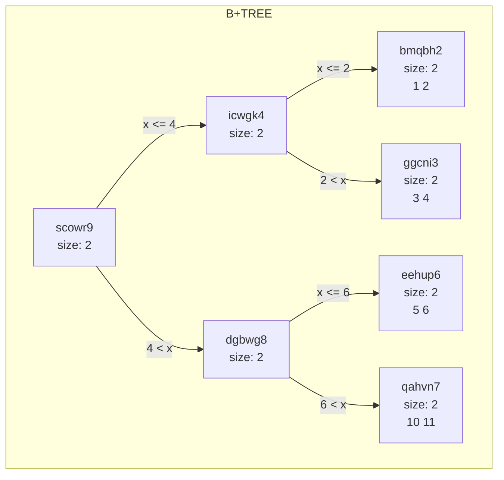
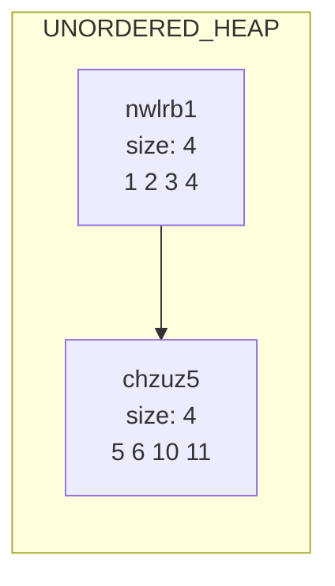

```mermaid
graph TD
subgraph B+TREE
scowr9[scowr9<br/>size: 2<br/>]
icwgk4[icwgk4<br/>size: 2<br/>]
bmqbh2[bmqbh2<br/>size: 2<br/>1 2 ]
icwgk4-->|x <= 2|bmqbh2
ggcni3[ggcni3<br/>size: 2<br/>3 4 ]
icwgk4-->|2 < x|ggcni3
scowr9-->|x <= 4|icwgk4
dgbwg8[dgbwg8<br/>size: 2<br/>]
eehup6[eehup6<br/>size: 2<br/>5 6 ]
dgbwg8-->|x <= 6|eehup6
qahvn7[qahvn7<br/>size: 2<br/>10 11 ]
dgbwg8-->|6 < x|qahvn7
scowr9-->|4 < x|dgbwg8
end
```

```mermaid
graph LR
subgraph UNORDERED_HEAP
nwlrb1[nwlrb1<br/>size: 4<br/>1 2 3 4 ]
chzuz5[chzuz5<br/>size: 4<br/>5 6 10 11 ]
nwlrb1-->chzuz5
end
```
